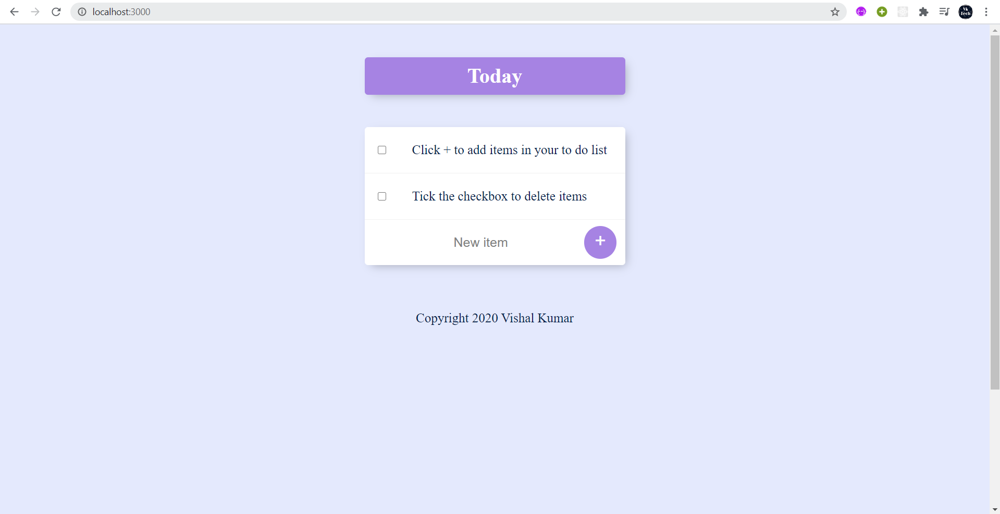
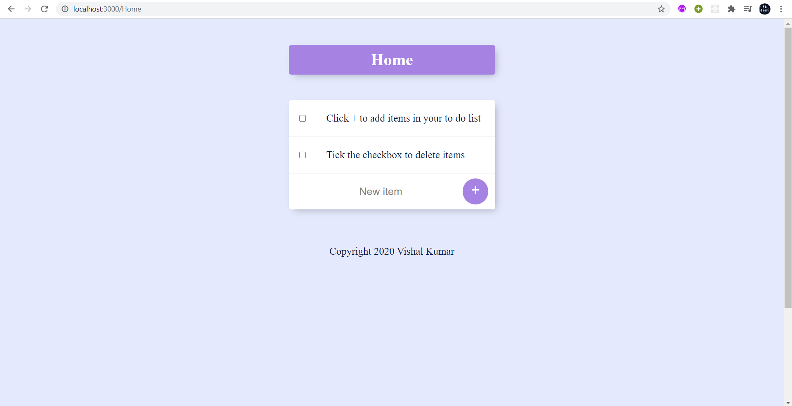

# Todolist-WebApp
- It maintains a TODO list of the user according to him/her.
- FrontEnd Technologies- HTML,CSS and JS
- BackEnd Technologies- Node.js,Express.js and EJS
- Database- MongoDB

# Process to run the app
- Install node.js
- run npm server.js
- you see the application running on port 3000 by typing url localhost:3000 in your browser.

- you can create as many list as you want by typing url localhost:3000/home,localhost:3000/work etc.

